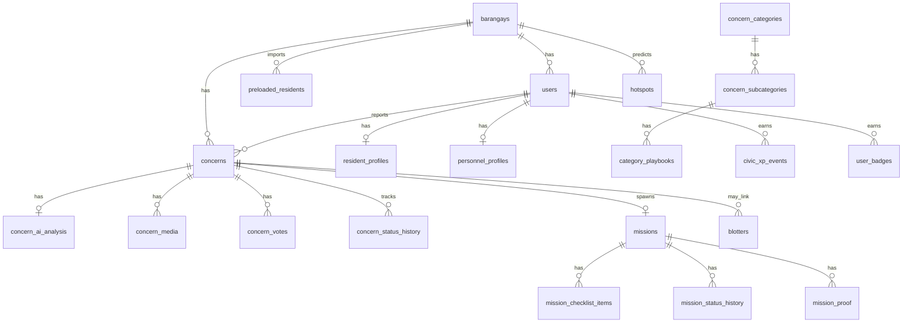

# Mission-Lokal — MySQL Database Design

Normalized relational schema derived from [BLUEPRINT.md](./BLUEPRINT.md). Targets **MySQL 8.0+** with `InnoDB`, `utf8mb4`, and spatial types (`POINT`, `POLYGON`).

UUIDs are `CHAR(36)`. Timestamps use `DATETIME(3)` UTC. Lookup tables replace rigid enums where values are configurable (categories, badges); fixed state machines stay as `ENUM`.

---

## Entity relationship overview



---

## 1. Platform & tenancy

### `barangays`

| Column | Type | Constraints | Notes |
| --- | --- | --- | --- |
| `id` | `CHAR(36)` | PK | UUID |
| `code` | `VARCHAR(32)` | UNIQUE, NOT NULL | Short slug |
| `name` | `VARCHAR(255)` | NOT NULL | |
| `boundary` | `POLYGON` | NOT NULL | SRID 4326 |
| `contact_phone` | `VARCHAR(20)` | | |
| `contact_email` | `VARCHAR(255)` | | |
| `office_hours` | `JSON` | | |
| `is_active` | `TINYINT(1)` | NOT NULL DEFAULT 1 | |
| `created_at` | `DATETIME(3)` | NOT NULL | |
| `updated_at` | `DATETIME(3)` | NOT NULL | |

**Indexes:** `UNIQUE uk_barangays_code (code)`, `SPATIAL INDEX spx_barangays_boundary (boundary)`

---

### `barangay_settings`

One row per barangay (blueprint §19).

| Column | Type | Constraints |
| --- | --- | --- |
| `barangay_id` | `CHAR(36)` | PK, FK → `barangays.id` |
| `ack_timeout_hours` | `SMALLINT UNSIGNED` | NOT NULL DEFAULT 4 |
| `duplicate_geo_radius_m` | `SMALLINT UNSIGNED` | NOT NULL DEFAULT 200 |
| `duplicate_time_window_h` | `SMALLINT UNSIGNED` | NOT NULL DEFAULT 72 |
| `auto_sms_nearby_radius_m` | `SMALLINT UNSIGNED` | NOT NULL DEFAULT 1500 |
| `max_personnel_sms_per_mission` | `TINYINT UNSIGNED` | NOT NULL DEFAULT 3 |
| `civic_xp_per_valid_report` | `SMALLINT UNSIGNED` | NOT NULL DEFAULT 10 |
| `civic_xp_per_resolution` | `SMALLINT UNSIGNED` | NOT NULL DEFAULT 5 |
| `civic_xp_per_upvote` | `SMALLINT UNSIGNED` | NOT NULL DEFAULT 2 |
| `location_fuzz_meters` | `SMALLINT UNSIGNED` | DEFAULT 50 |
| `sms_sender_id` | `VARCHAR(20)` | |
| `updated_at` | `DATETIME(3)` | NOT NULL |

---

## 2. Identity & onboarding

### `preloaded_residents`

CSV roster before first login.

| Column | Type | Constraints |
| --- | --- | --- |
| `id` | `CHAR(36)` | PK |
| `barangay_id` | `CHAR(36)` | FK → `barangays.id`, NOT NULL |
| `account_id` | `VARCHAR(64)` | NOT NULL |
| `full_name` | `VARCHAR(255)` | NOT NULL |
| `birthday` | `DATE` | NOT NULL |
| `address` | `TEXT` | |
| `email` | `VARCHAR(255)` | |
| `mobile` | `VARCHAR(20)` | |
| `user_id` | `CHAR(36)` | FK → `users.id`, NULL |
| `imported_at` | `DATETIME(3)` | NOT NULL |

**Indexes:** `UNIQUE uk_preloaded_account (barangay_id, account_id)`, `INDEX idx_preloaded_user (user_id)`

---

### `users`

| Column | Type | Constraints |
| --- | --- | --- |
| `id` | `CHAR(36)` | PK |
| `barangay_id` | `CHAR(36)` | FK → `barangays.id`, NULL for super_admin |
| `account_id` | `VARCHAR(64)` | NOT NULL |
| `role` | `ENUM('resident','personnel','admin','super_admin')` | NOT NULL |
| `email` | `VARCHAR(255)` | |
| `mobile` | `VARCHAR(20)` | |
| `password` | `VARCHAR(255)` | NULL until verified |
| `verification_status` | `ENUM('pending','in_progress','approved','rejected')` | NOT NULL DEFAULT 'pending' |
| `profile_edit_status` | `ENUM('none','pending_approval')` | NOT NULL DEFAULT 'none' |
| `civic_xp` | `INT UNSIGNED` | NOT NULL DEFAULT 0 |
| `is_active` | `TINYINT(1)` | NOT NULL DEFAULT 1 |
| `last_login_at` | `DATETIME(3)` | |
| `created_at` | `DATETIME(3)` | NOT NULL |
| `updated_at` | `DATETIME(3)` | NOT NULL |

**Indexes:**

- `UNIQUE uk_users_account (barangay_id, account_id)`
- `INDEX idx_users_role (barangay_id, role)`
- `INDEX idx_users_verification (barangay_id, verification_status)`
- `INDEX idx_users_xp (barangay_id, civic_xp DESC)` — leaderboard

---

### `resident_profiles`

| Column | Type | Constraints |
| --- | --- | --- |
| `user_id` | `CHAR(36)` | PK, FK → `users.id` |
| `full_name` | `VARCHAR(255)` | NOT NULL |
| `birthday` | `DATE` | NOT NULL |
| `address` | `TEXT` | |
| `government_id_storage_key` | `VARCHAR(512)` | Encrypted object key |
| `government_id_mime` | `VARCHAR(64)` | |
| `digital_id_code` | `VARCHAR(64)` | UNIQUE, NULL until approved |
| `rejection_reason` | `TEXT` | |
| `confirmed_details_at` | `DATETIME(3)` | |
| `id_submitted_at` | `DATETIME(3)` | |
| `updated_at` | `DATETIME(3)` | NOT NULL |

**Indexes:** `UNIQUE uk_digital_id (digital_id_code)`

---

### `profile_edit_requests`

| Column | Type | Constraints |
| --- | --- | --- |
| `id` | `CHAR(36)` | PK |
| `user_id` | `CHAR(36)` | FK → `users.id` |
| `requested_changes` | `JSON` | NOT NULL |
| `status` | `ENUM('pending','approved','rejected')` | NOT NULL DEFAULT 'pending' |
| `reviewed_by` | `CHAR(36)` | FK → `users.id` |
| `rejection_reason` | `TEXT` | |
| `created_at` | `DATETIME(3)` | NOT NULL |
| `reviewed_at` | `DATETIME(3)` | |

**Indexes:** `INDEX idx_profile_edits_queue (status, created_at)`, `INDEX idx_profile_edits_user (user_id, created_at DESC)`

---

### `personnel_profiles`

Personnel zone / last known location for nearby SMS.

| Column | Type | Constraints |
| --- | --- | --- |
| `user_id` | `CHAR(36)` | PK, FK → `users.id` |
| `display_name` | `VARCHAR(255)` | NOT NULL |
| `registered_zone` | `POINT` | SRID 4326 |
| `last_known_location` | `POINT` | SRID 4326 |
| `location_updated_at` | `DATETIME(3)` | |
| `sms_enabled` | `TINYINT(1)` | NOT NULL DEFAULT 1 |

**Indexes:** `SPATIAL INDEX spx_personnel_zone (registered_zone)`, `SPATIAL INDEX spx_personnel_last (last_known_location)`

---

### `refresh_tokens`

| Column | Type | Constraints |
| --- | --- | --- |
| `id` | `CHAR(36)` | PK |
| `user_id` | `CHAR(36)` | FK → `users.id` |
| `token_hash` | `CHAR(64)` | NOT NULL |
| `expires_at` | `DATETIME(3)` | NOT NULL |
| `revoked_at` | `DATETIME(3)` | |
| `created_at` | `DATETIME(3)` | NOT NULL |

**Indexes:** `INDEX idx_refresh_user (user_id)`, `UNIQUE uk_refresh_hash (token_hash)`

---

### `password_reset_tokens`

| Column | Type | Constraints |
| --- | --- | --- |
| `id` | `CHAR(36)` | PK |
| `user_id` | `CHAR(36)` | FK → `users.id` |
| `otp_hash` | `CHAR(64)` | NOT NULL |
| `expires_at` | `DATETIME(3)` | NOT NULL |
| `used_at` | `DATETIME(3)` | |
| `created_at` | `DATETIME(3)` | NOT NULL |

**Indexes:** `INDEX idx_reset_user (user_id, expires_at)`

---

## 3. Categories & playbooks

### `concern_categories`

| Column | Type | Constraints |
| --- | --- | --- |
| `id` | `SMALLINT UNSIGNED` | PK AUTO_INCREMENT |
| `barangay_id` | `CHAR(36)` | FK → `barangays.id`, NULL = global template |
| `code` | `VARCHAR(64)` | NOT NULL |
| `name` | `VARCHAR(128)` | NOT NULL |
| `default_visibility` | `ENUM('public','private')` | NOT NULL |
| `sort_order` | `SMALLINT` | NOT NULL DEFAULT 0 |
| `is_active` | `TINYINT(1)` | NOT NULL DEFAULT 1 |

**Indexes:** `UNIQUE uk_category_code (barangay_id, code)`

Seed from blueprint §12 (Public Safety, Infrastructure, Sanitation, Katarungang Pambarangay).

---

### `concern_subcategories`

| Column | Type | Constraints |
| --- | --- | --- |
| `id` | `SMALLINT UNSIGNED` | PK AUTO_INCREMENT |
| `category_id` | `SMALLINT UNSIGNED` | FK → `concern_categories.id` |
| `code` | `VARCHAR(64)` | NOT NULL |
| `name` | `VARCHAR(128)` | NOT NULL |
| `force_private` | `TINYINT(1)` | NOT NULL DEFAULT 0 |
| `is_active` | `TINYINT(1)` | NOT NULL DEFAULT 1 |

**Indexes:** `UNIQUE uk_subcategory (category_id, code)`

---

### `category_playbooks`

| Column | Type | Constraints |
| --- | --- | --- |
| `id` | `CHAR(36)` | PK |
| `subcategory_id` | `SMALLINT UNSIGNED` | FK → `concern_subcategories.id` |
| `title` | `VARCHAR(255)` | NOT NULL |
| `steps_template` | `JSON` | Ordered step definitions |
| `default_duration_hours` | `SMALLINT UNSIGNED` | |
| `default_due_days` | `TINYINT UNSIGNED` | |
| `is_active` | `TINYINT(1)` | NOT NULL DEFAULT 1 |

**Indexes:** `INDEX idx_playbook_subcategory (subcategory_id)`

---

## 4. Concerns (reports)

### `concerns`

| Column | Type | Constraints |
| --- | --- | --- |
| `id` | `CHAR(36)` | PK |
| `barangay_id` | `CHAR(36)` | FK → `barangays.id`, NOT NULL |
| `reporter_id` | `CHAR(36)` | FK → `users.id`, NOT NULL |
| `title` | `VARCHAR(255)` | NOT NULL |
| `description` | `TEXT` | NOT NULL |
| `category_id` | `SMALLINT UNSIGNED` | FK → `concern_categories.id` |
| `subcategory_id` | `SMALLINT UNSIGNED` | FK → `concern_subcategories.id` |
| `visibility` | `ENUM('public','private')` | NOT NULL |
| `severity` | `ENUM('low','medium','high','critical')` | |
| `severity_confirmed` | `TINYINT(1)` | NOT NULL DEFAULT 0 |
| `status` | `ENUM('submitted','ai_processed','under_review','rejected','spam','active','resolved','closed')` | NOT NULL DEFAULT 'submitted' |
| `location` | `POINT` | NOT NULL, SRID 4326 |
| `public_location` | `POINT` | Fuzzed pin for public feed |
| `address_text` | `VARCHAR(512)` | |
| `is_blotter_candidate` | `TINYINT(1)` | NOT NULL DEFAULT 0 |
| `duplicate_of_id` | `CHAR(36)` | FK → `concerns.id`, NULL |
| `ai_processed_at` | `DATETIME(3)` | |
| `staff_reviewed_by` | `CHAR(36)` | FK → `users.id` |
| `staff_reviewed_at` | `DATETIME(3)` | |
| `closed_summary` | `TEXT` | Outcome text for resident |
| `created_at` | `DATETIME(3)` | NOT NULL |
| `updated_at` | `DATETIME(3)` | NOT NULL |

**Indexes:**

- `INDEX idx_concerns_feed (barangay_id, visibility, status, created_at DESC)` — public feed
- `INDEX idx_concerns_reporter (reporter_id, created_at DESC)`
- `INDEX idx_concerns_queue (barangay_id, status, ai_processed_at)` — admin queue
- `INDEX idx_concerns_duplicate (duplicate_of_id)`
- `SPATIAL INDEX spx_concerns_location (location)`
- `FULLTEXT INDEX ftx_concerns_search (title, description)` — duplicate / search

---

### `concern_ai_analysis`

One current analysis per concern; retain rows if reprocessed.

| Column | Type | Constraints |
| --- | --- | --- |
| `id` | `CHAR(36)` | PK |
| `concern_id` | `CHAR(36)` | FK → `concerns.id`, NOT NULL |
| `is_current` | `TINYINT(1)` | NOT NULL DEFAULT 1 |
| `detected_language` | `ENUM('en','fil','mixed')` | |
| `suggested_category_id` | `SMALLINT UNSIGNED` | FK |
| `suggested_subcategory_id` | `SMALLINT UNSIGNED` | FK |
| `suggested_visibility` | `ENUM('public','private')` | |
| `suggested_severity` | `ENUM('low','medium','high','critical')` | |
| `severity_confidence` | `DECIMAL(4,3)` | 0–1 |
| `embedding` | `JSON` | Vector as JSON array (or external vector store) |
| `prescriptive_steps` | `JSON` | AI checklist snapshot |
| `suggested_due_date` | `DATE` | |
| `suggested_duration_hours` | `SMALLINT UNSIGNED` | |
| `duplicate_candidate_id` | `CHAR(36)` | FK → `concerns.id` |
| `duplicate_similarity` | `DECIMAL(5,4)` | |
| `raw_model_output` | `JSON` | |
| `processed_at` | `DATETIME(3)` | NOT NULL |

**Indexes:** `INDEX idx_ai_concern (concern_id, is_current)`, `INDEX idx_ai_duplicate (duplicate_candidate_id)`

Enforce one `is_current = 1` per concern in application logic.

---

### `concern_duplicate_links`

Staff actions: merge, link, dismiss.

| Column | Type | Constraints |
| --- | --- | --- |
| `id` | `CHAR(36)` | PK |
| `primary_concern_id` | `CHAR(36)` | FK → `concerns.id` |
| `linked_concern_id` | `CHAR(36)` | FK → `concerns.id` |
| `link_type` | `ENUM('merge','link','dismissed')` | NOT NULL |
| `created_by` | `CHAR(36)` | FK → `users.id` |
| `created_at` | `DATETIME(3)` | NOT NULL |

**Indexes:** `UNIQUE uk_duplicate_pair (primary_concern_id, linked_concern_id)`, `INDEX idx_duplicate_linked (linked_concern_id)`

---

### `concern_media`

| Column | Type | Constraints |
| --- | --- | --- |
| `id` | `CHAR(36)` | PK |
| `concern_id` | `CHAR(36)` | FK → `concerns.id` |
| `storage_key` | `VARCHAR(512)` | NOT NULL |
| `mime_type` | `VARCHAR(64)` | NOT NULL |
| `sort_order` | `TINYINT UNSIGNED` | NOT NULL DEFAULT 0 |
| `created_at` | `DATETIME(3)` | NOT NULL |

**Indexes:** `INDEX idx_concern_media (concern_id, sort_order)`

---

### `concern_votes`

| Column | Type | Constraints |
| --- | --- | --- |
| `concern_id` | `CHAR(36)` | PK part, FK → `concerns.id` |
| `user_id` | `CHAR(36)` | PK part, FK → `users.id` |
| `vote` | `TINYINT` | NOT NULL, CHECK -1 or 1 |
| `created_at` | `DATETIME(3)` | NOT NULL |
| `updated_at` | `DATETIME(3)` | NOT NULL |

**PK:** `(concern_id, user_id)`  
**Indexes:** `INDEX idx_votes_user (user_id)`

---

### `concern_status_history`

Audit trail for concern state machine (§5.1).

| Column | Type | Constraints |
| --- | --- | --- |
| `id` | `BIGINT UNSIGNED` | PK AUTO_INCREMENT |
| `concern_id` | `CHAR(36)` | FK → `concerns.id` |
| `from_status` | `VARCHAR(32)` | |
| `to_status` | `VARCHAR(32)` | NOT NULL |
| `actor_id` | `CHAR(36)` | FK → `users.id` |
| `note` | `TEXT` | |
| `created_at` | `DATETIME(3)` | NOT NULL |

**Indexes:** `INDEX idx_concern_status_hist (concern_id, created_at)`

---

## 5. Missions

### `missions`

| Column | Type | Constraints |
| --- | --- | --- |
| `id` | `CHAR(36)` | PK |
| `barangay_id` | `CHAR(36)` | FK → `barangays.id` |
| `concern_id` | `CHAR(36)` | FK → `concerns.id`, UNIQUE |
| `assigned_to` | `CHAR(36)` | FK → `users.id`, current personnel |
| `playbook_id` | `CHAR(36)` | FK → `category_playbooks.id` |
| `due_date` | `DATE` | |
| `estimated_duration_hours` | `SMALLINT UNSIGNED` | |
| `status` | `ENUM('assigned','acknowledged','in_progress','completed','verified','cancelled')` | NOT NULL DEFAULT 'assigned' |
| `is_overdue` | `TINYINT(1)` | NOT NULL DEFAULT 0 |
| `is_escalated` | `TINYINT(1)` | NOT NULL DEFAULT 0 |
| `acknowledged_at` | `DATETIME(3)` | |
| `completed_at` | `DATETIME(3)` | |
| `verified_at` | `DATETIME(3)` | |
| `verified_by` | `CHAR(36)` | FK → `users.id` |
| `closed_summary` | `TEXT` | Shown to resident |
| `created_by` | `CHAR(36)` | FK → `users.id` |
| `created_at` | `DATETIME(3)` | NOT NULL |
| `updated_at` | `DATETIME(3)` | NOT NULL |

**Indexes:**

- `UNIQUE uk_mission_concern (concern_id)` — one mission per concern (MVP)
- `INDEX idx_missions_assignee (assigned_to, status, due_date)`
- `INDEX idx_missions_board (barangay_id, status, is_overdue, is_escalated)`
- `INDEX idx_missions_escalation (status, acknowledged_at)` — ACK timeout job

---

### `mission_assignments`

Reassignment history.

| Column | Type | Constraints |
| --- | --- | --- |
| `id` | `CHAR(36)` | PK |
| `mission_id` | `CHAR(36)` | FK → `missions.id` |
| `personnel_id` | `CHAR(36)` | FK → `users.id` |
| `assigned_by` | `CHAR(36)` | FK → `users.id` |
| `assigned_at` | `DATETIME(3)` | NOT NULL |
| `unassigned_at` | `DATETIME(3)` | |
| `sms_sent_at` | `DATETIME(3)` | |

**Indexes:** `INDEX idx_mission_assign_active (mission_id, unassigned_at)`, `INDEX idx_mission_assign_personnel (personnel_id, assigned_at DESC)`

---

### `mission_checklist_items`

Normalized from `prescriptive_steps` JSON.

| Column | Type | Constraints |
| --- | --- | --- |
| `id` | `CHAR(36)` | PK |
| `mission_id` | `CHAR(36)` | FK → `missions.id` |
| `step_order` | `SMALLINT UNSIGNED` | NOT NULL |
| `description` | `TEXT` | NOT NULL |
| `is_completed` | `TINYINT(1)` | NOT NULL DEFAULT 0 |
| `completed_at` | `DATETIME(3)` | |
| `completed_by` | `CHAR(36)` | FK → `users.id` |

**Indexes:** `UNIQUE uk_checklist_order (mission_id, step_order)`

---

### `mission_status_history`

| Column | Type | Constraints |
| --- | --- | --- |
| `id` | `BIGINT UNSIGNED` | PK AUTO_INCREMENT |
| `mission_id` | `CHAR(36)` | FK → `missions.id` |
| `from_status` | `VARCHAR(32)` | |
| `to_status` | `VARCHAR(32)` | NOT NULL |
| `actor_id` | `CHAR(36)` | FK → `users.id` |
| `note` | `TEXT` | |
| `created_at` | `DATETIME(3)` | NOT NULL |

**Indexes:** `INDEX idx_mission_status_hist (mission_id, created_at)`

---

### `mission_proof`

| Column | Type | Constraints |
| --- | --- | --- |
| `id` | `CHAR(36)` | PK |
| `mission_id` | `CHAR(36)` | FK → `missions.id` |
| `submitted_by` | `CHAR(36)` | FK → `users.id` |
| `notes` | `TEXT` | |
| `submitted_at` | `DATETIME(3)` | NOT NULL |

**Indexes:** `INDEX idx_proof_mission (mission_id, submitted_at DESC)`

---

### `mission_proof_media`

| Column | Type | Constraints |
| --- | --- | --- |
| `id` | `CHAR(36)` | PK |
| `proof_id` | `CHAR(36)` | FK → `mission_proof.id` |
| `storage_key` | `VARCHAR(512)` | NOT NULL |
| `mime_type` | `VARCHAR(64)` | NOT NULL |
| `caption` | `VARCHAR(255)` | |
| `created_at` | `DATETIME(3)` | NOT NULL |

**Indexes:** `INDEX idx_proof_media (proof_id)`

---

## 6. Blotters

### `blotters`

| Column | Type | Constraints |
| --- | --- | --- |
| `id` | `CHAR(36)` | PK |
| `barangay_id` | `CHAR(36)` | FK → `barangays.id` |
| `concern_id` | `CHAR(36)` | FK → `concerns.id`, NULL |
| `type` | `ENUM('two_party','one_party')` | NOT NULL |
| `complainant_id` | `CHAR(36)` | FK → `users.id` |
| `respondent_name` | `VARCHAR(255)` | Two-party |
| `narrative` | `TEXT` | NOT NULL |
| `incident_at` | `DATETIME(3)` | |
| `incident_location` | `POINT` | SRID 4326 |
| `incident_address` | `VARCHAR(512)` | |
| `relief_sought` | `TEXT` | |
| `witnesses` | `JSON` | Optional list |
| `signature_ack_at` | `DATETIME(3)` | |
| `ticket_number` | `VARCHAR(32)` | UNIQUE when issued |
| `status` | `ENUM('pending_approval','filed','mediated','resolved','archived','rejected')` | NOT NULL DEFAULT 'pending_approval' |
| `hearing_scheduled_at` | `DATETIME(3)` | |
| `approved_by` | `CHAR(36)` | FK → `users.id` |
| `approved_at` | `DATETIME(3)` | |
| `created_at` | `DATETIME(3)` | NOT NULL |
| `updated_at` | `DATETIME(3)` | NOT NULL |

**Indexes:**

- `INDEX idx_blotters_queue (barangay_id, status, created_at)`
- `INDEX idx_blotters_complainant (complainant_id)`
- `UNIQUE uk_blotter_ticket (barangay_id, ticket_number)`
- `SPATIAL INDEX spx_blotter_location (incident_location)`

---

### `blotter_media`

| Column | Type | Constraints |
| --- | --- | --- |
| `id` | `CHAR(36)` | PK |
| `blotter_id` | `CHAR(36)` | FK → `blotters.id` |
| `storage_key` | `VARCHAR(512)` | NOT NULL |
| `mime_type` | `VARCHAR(64)` | NOT NULL |
| `created_at` | `DATETIME(3)` | NOT NULL |

---

## 7. Content

### `announcements`

| Column | Type | Constraints |
| --- | --- | --- |
| `id` | `CHAR(36)` | PK |
| `barangay_id` | `CHAR(36)` | FK → `barangays.id` |
| `title` | `VARCHAR(255)` | NOT NULL |
| `body` | `TEXT` | NOT NULL |
| `is_published` | `TINYINT(1)` | NOT NULL DEFAULT 0 |
| `published_at` | `DATETIME(3)` | |
| `created_by` | `CHAR(36)` | FK → `users.id` |
| `created_at` | `DATETIME(3)` | NOT NULL |
| `updated_at` | `DATETIME(3)` | NOT NULL |

**Indexes:** `INDEX idx_announcements_feed (barangay_id, is_published, published_at DESC)`

---

### `library_items`

| Column | Type | Constraints |
| --- | --- | --- |
| `id` | `CHAR(36)` | PK |
| `barangay_id` | `CHAR(36)` | FK → `barangays.id` |
| `type` | `ENUM('manual','contact','evacuation_center','emergency','faq')` | NOT NULL |
| `title` | `VARCHAR(255)` | NOT NULL |
| `content` | `TEXT` | |
| `metadata` | `JSON` | Phone, coords, hours |
| `location` | `POINT` | For evacuation centers |
| `sort_order` | `SMALLINT` | DEFAULT 0 |
| `is_active` | `TINYINT(1)` | NOT NULL DEFAULT 1 |
| `created_at` | `DATETIME(3)` | NOT NULL |
| `updated_at` | `DATETIME(3)` | NOT NULL |

**Indexes:** `INDEX idx_library (barangay_id, type, is_active, sort_order)`, `SPATIAL INDEX spx_library_location (location)`

---

## 8. Gamification

### `badges`

| Column | Type | Constraints |
| --- | --- | --- |
| `id` | `SMALLINT UNSIGNED` | PK AUTO_INCREMENT |
| `barangay_id` | `CHAR(36)` | FK, NULL = global |
| `code` | `VARCHAR(64)` | NOT NULL |
| `name` | `VARCHAR(128)` | NOT NULL |
| `description` | `TEXT` | |
| `criteria_json` | `JSON` | Rule definition |
| `icon_url` | `VARCHAR(512)` | |

**Indexes:** `UNIQUE uk_badge_code (barangay_id, code)`

---

### `user_badges`

| Column | Type | Constraints |
| --- | --- | --- |
| `user_id` | `CHAR(36)` | PK part, FK → `users.id` |
| `badge_id` | `SMALLINT UNSIGNED` | PK part, FK → `badges.id` |
| `awarded_at` | `DATETIME(3)` | NOT NULL |
| `metadata` | `JSON` | e.g. hotspot id |

**PK:** `(user_id, badge_id)`

---

### `civic_xp_events`

| Column | Type | Constraints |
| --- | --- | --- |
| `id` | `CHAR(36)` | PK |
| `user_id` | `CHAR(36)` | FK → `users.id` |
| `barangay_id` | `CHAR(36)` | FK → `barangays.id` |
| `action` | `VARCHAR(64)` | e.g. `valid_report`, `resolution` |
| `points` | `SMALLINT` | NOT NULL |
| `reference_type` | `VARCHAR(32)` | `concern`, `event` |
| `reference_id` | `CHAR(36)` | |
| `created_at` | `DATETIME(3)` | NOT NULL |

**Indexes:**

- `INDEX idx_xp_user (user_id, created_at DESC)`
- `INDEX idx_xp_barangay (barangay_id, created_at DESC)`
- `UNIQUE uk_xp_once (user_id, action, reference_type, reference_id)` — idempotent awards

---

## 9. Analytics & hotspots

### `hotspots`

Nightly clustering output (§6.5).

| Column | Type | Constraints |
| --- | --- | --- |
| `id` | `CHAR(36)` | PK |
| `barangay_id` | `CHAR(36)` | FK → `barangays.id` |
| `window_days` | `SMALLINT UNSIGNED` | 30 or 90 |
| `center` | `POINT` | NOT NULL |
| `radius_m` | `SMALLINT UNSIGNED` | NOT NULL |
| `report_count` | `INT UNSIGNED` | NOT NULL |
| `top_categories` | `JSON` | |
| `computed_at` | `DATETIME(3)` | NOT NULL |

**Indexes:** `INDEX idx_hotspots (barangay_id, window_days, computed_at DESC)`, `SPATIAL INDEX spx_hotspots_center (center)`

---

## 10. Notifications & messaging

### `notifications`

| Column | Type | Constraints |
| --- | --- | --- |
| `id` | `CHAR(36)` | PK |
| `user_id` | `CHAR(36)` | FK → `users.id` |
| `channel` | `ENUM('in_app','push','email','sms')` | NOT NULL |
| `event_type` | `VARCHAR(64)` | NOT NULL |
| `title` | `VARCHAR(255)` | |
| `body` | `TEXT` | NOT NULL |
| `payload` | `JSON` | Deep link, entity refs |
| `is_read` | `TINYINT(1)` | NOT NULL DEFAULT 0 |
| `sent_at` | `DATETIME(3)` | |
| `read_at` | `DATETIME(3)` | |
| `created_at` | `DATETIME(3)` | NOT NULL |

**Indexes:** `INDEX idx_notifications_inbox (user_id, is_read, created_at DESC)`, `INDEX idx_notifications_event (event_type, created_at)`

---

### `notification_outbox`

Reliable delivery for SMS/email/push workers.

| Column | Type | Constraints |
| --- | --- | --- |
| `id` | `CHAR(36)` | PK |
| `notification_id` | `CHAR(36)` | FK → `notifications.id` |
| `status` | `ENUM('pending','sent','failed')` | NOT NULL DEFAULT 'pending' |
| `attempts` | `TINYINT UNSIGNED` | NOT NULL DEFAULT 0 |
| `last_error` | `TEXT` | |
| `scheduled_at` | `DATETIME(3)` | NOT NULL |
| `processed_at` | `DATETIME(3)` | |

**Indexes:** `INDEX idx_outbox_worker (status, scheduled_at)`

---

### `push_subscriptions`

PWA web push endpoints.

| Column | Type | Constraints |
| --- | --- | --- |
| `id` | `CHAR(36)` | PK |
| `user_id` | `CHAR(36)` | FK → `users.id` |
| `endpoint` | `VARCHAR(768)` | NOT NULL |
| `p256dh` | `VARCHAR(255)` | NOT NULL |
| `auth` | `VARCHAR(255)` | NOT NULL |
| `created_at` | `DATETIME(3)` | NOT NULL |

**Indexes:** `UNIQUE uk_push_endpoint (endpoint(255))`, `INDEX idx_push_user (user_id)`

---

## 11. Audit & jobs

### `audit_logs`

| Column | Type | Constraints |
| --- | --- | --- |
| `id` | `BIGINT UNSIGNED` | PK AUTO_INCREMENT |
| `barangay_id` | `CHAR(36)` | FK → `barangays.id` |
| `actor_id` | `CHAR(36)` | FK → `users.id` |
| `action` | `VARCHAR(64)` | NOT NULL |
| `entity_type` | `VARCHAR(64)` | NOT NULL |
| `entity_id` | `CHAR(36)` | NOT NULL |
| `metadata` | `JSON` | |
| `ip_address` | `VARBINARY(16)` | IPv4/IPv6 |
| `created_at` | `DATETIME(3)` | NOT NULL |

**Indexes:**

- `INDEX idx_audit_entity (entity_type, entity_id, created_at DESC)`
- `INDEX idx_audit_actor (actor_id, created_at DESC)`
- `INDEX idx_audit_barangay (barangay_id, created_at DESC)`

---

### `background_jobs` *(optional; or use Redis queue only)*

| Column | Type | Constraints |
| --- | --- | --- |
| `id` | `CHAR(36)` | PK |
| `job_type` | `VARCHAR(64)` | `ai_concern_processor`, `hotspot_cluster`, etc. |
| `payload` | `JSON` | |
| `status` | `ENUM('queued','processing','done','failed')` | |
| `attempts` | `TINYINT UNSIGNED` | DEFAULT 0 |
| `run_after` | `DATETIME(3)` | |
| `created_at` | `DATETIME(3)` | |

**Indexes:** `INDEX idx_jobs_queue (status, run_after)`

---

## 12. Foreign key summary

| Child table | FK column(s) | Parent |
| --- | --- | --- |
| `barangay_settings` | `barangay_id` | `barangays` |
| `preloaded_residents` | `barangay_id`, `user_id` | `barangays`, `users` |
| `users` | `barangay_id` | `barangays` |
| `resident_profiles`, `personnel_profiles` | `user_id` | `users` |
| `profile_edit_requests` | `user_id`, `reviewed_by` | `users` |
| `concern_categories` | `barangay_id` | `barangays` |
| `concern_subcategories` | `category_id` | `concern_categories` |
| `category_playbooks` | `subcategory_id` | `concern_subcategories` |
| `concerns` | `barangay_id`, `reporter_id`, `category_id`, `subcategory_id`, `duplicate_of_id`, `staff_reviewed_by` | respective parents |
| `concern_ai_analysis` | `concern_id`, suggested FKs, `duplicate_candidate_id` | `concerns`, categories |
| `concern_media`, `concern_votes`, `concern_status_history` | `concern_id` | `concerns` |
| `missions` | `barangay_id`, `concern_id`, `assigned_to`, `playbook_id`, `verified_by`, `created_by` | respective parents |
| `mission_*` | `mission_id` | `missions` |
| `blotters` | `barangay_id`, `concern_id`, `complainant_id`, `approved_by` | respective parents |
| `announcements`, `library_items`, `hotspots` | `barangay_id` | `barangays` |
| `civic_xp_events`, `user_badges` | `user_id` | `users` |
| `notifications` | `user_id` | `users` |
| `audit_logs` | `barangay_id`, `actor_id` | `barangays`, `users` |

**ON DELETE (recommended):**

- Tenant children → `RESTRICT` on `barangays`
- `concerns.reporter_id` → `RESTRICT`
- `concerns.duplicate_of_id` → `SET NULL`
- `mission_proof_media` → `CASCADE` on `proof_id`
- `concern_media` → `CASCADE` on `concern_id`

---

## 13. Indexing strategy

| Access pattern | Index |
| --- | --- |
| Public feed by barangay | `(barangay_id, visibility, status, created_at DESC)` |
| Admin report queue | `(barangay_id, status)` + filter `status IN ('ai_processed','under_review')` |
| Personnel mission list | `(assigned_to, status, due_date)` |
| ACK escalation cron | `(status, acknowledged_at)` WHERE `status = 'assigned'` |
| Geo duplicate check | Spatial on `concerns.location` + time filter on `created_at` |
| Nearby personnel | Spatial on `personnel_profiles.last_known_location` |
| Leaderboard | `(barangay_id, civic_xp DESC)` on `users` |
| Audit compliance | `(barangay_id, created_at DESC)` on `audit_logs` |
| Full-text duplicate/search | `FULLTEXT(title, description)` on `concerns` |
| Idempotent XP | Unique on `(user_id, action, reference_type, reference_id)` |

---

## 14. Normalization notes

1. **3NF:** Category names and playbook steps are not duplicated across concerns except intentional snapshots in `concern_ai_analysis`.
2. **Votes:** Composite PK `(concern_id, user_id)` avoids surrogate key collisions.
3. **Mission checklist:** Split from JSON for personnel tick-off and progress queries.
4. **Assignment history:** `missions.assigned_to` = current; `mission_assignments` = full history + SMS timestamps.
5. **Embeddings:** For production duplicate detection at scale, consider `concern_embeddings (concern_id, embedding, model_version)` or an external vector store.
6. **Multi-tenant:** Every operational row carries `barangay_id (directly or via users/concerns)` for row-level security in the application layer.

---

## 15. Sample DDL (core tables)

```sql
CREATE TABLE barangays (
  id            CHAR(36)     NOT NULL PRIMARY KEY,
  code          VARCHAR(32)  NOT NULL,
  name          VARCHAR(255) NOT NULL,
  boundary      POLYGON      NOT NULL SRID 4326,
  contact_phone VARCHAR(20),
  contact_email VARCHAR(255),
  office_hours  JSON,
  is_active     TINYINT(1)   NOT NULL DEFAULT 1,
  created_at    DATETIME(3)  NOT NULL,
  updated_at    DATETIME(3)  NOT NULL,
  UNIQUE KEY uk_barangays_code (code),
  SPATIAL INDEX spx_barangays_boundary (boundary)
) ENGINE=InnoDB DEFAULT CHARSET=utf8mb4 COLLATE=utf8mb4_unicode_ci;

CREATE TABLE users (
  id                  CHAR(36) NOT NULL PRIMARY KEY,
  barangay_id         CHAR(36),
  account_id          VARCHAR(64) NOT NULL,
  role                ENUM('resident','personnel','admin','super_admin') NOT NULL,
  email               VARCHAR(255),
  mobile              VARCHAR(20),
  password            VARCHAR(255),
  verification_status ENUM('pending','in_progress','approved','rejected') NOT NULL DEFAULT 'pending',
  profile_edit_status ENUM('none','pending_approval') NOT NULL DEFAULT 'none',
  civic_xp            INT UNSIGNED NOT NULL DEFAULT 0,
  is_active           TINYINT(1) NOT NULL DEFAULT 1,
  last_login_at       DATETIME(3),
  created_at          DATETIME(3) NOT NULL,
  updated_at          DATETIME(3) NOT NULL,
  UNIQUE KEY uk_users_account (barangay_id, account_id),
  KEY idx_users_role (barangay_id, role),
  KEY idx_users_verification (barangay_id, verification_status),
  KEY idx_users_xp (barangay_id, civic_xp DESC),
  CONSTRAINT fk_users_barangay FOREIGN KEY (barangay_id) REFERENCES barangays(id)
) ENGINE=InnoDB DEFAULT CHARSET=utf8mb4 COLLATE=utf8mb4_unicode_ci;

CREATE TABLE concerns (
  id                   CHAR(36) NOT NULL PRIMARY KEY,
  barangay_id          CHAR(36) NOT NULL,
  reporter_id          CHAR(36) NOT NULL,
  title                VARCHAR(255) NOT NULL,
  description          TEXT NOT NULL,
  category_id          SMALLINT UNSIGNED,
  subcategory_id       SMALLINT UNSIGNED,
  visibility           ENUM('public','private') NOT NULL,
  severity             ENUM('low','medium','high','critical'),
  severity_confirmed   TINYINT(1) NOT NULL DEFAULT 0,
  status               ENUM('submitted','ai_processed','under_review','rejected','spam','active','resolved','closed') NOT NULL DEFAULT 'submitted',
  location             POINT NOT NULL SRID 4326,
  public_location      POINT SRID 4326,
  address_text         VARCHAR(512),
  is_blotter_candidate TINYINT(1) NOT NULL DEFAULT 0,
  duplicate_of_id      CHAR(36),
  ai_processed_at      DATETIME(3),
  staff_reviewed_by    CHAR(36),
  staff_reviewed_at    DATETIME(3),
  closed_summary       TEXT,
  created_at           DATETIME(3) NOT NULL,
  updated_at           DATETIME(3) NOT NULL,
  KEY idx_concerns_feed (barangay_id, visibility, status, created_at),
  KEY idx_concerns_reporter (reporter_id, created_at),
  KEY idx_concerns_queue (barangay_id, status, ai_processed_at),
  SPATIAL INDEX spx_concerns_location (location),
  FULLTEXT KEY ftx_concerns_search (title, description),
  CONSTRAINT fk_concerns_barangay FOREIGN KEY (barangay_id) REFERENCES barangays(id),
  CONSTRAINT fk_concerns_reporter FOREIGN KEY (reporter_id) REFERENCES users(id),
  CONSTRAINT fk_concerns_duplicate FOREIGN KEY (duplicate_of_id) REFERENCES concerns(id) ON DELETE SET NULL
) ENGINE=InnoDB DEFAULT CHARSET=utf8mb4 COLLATE=utf8mb4_unicode_ci;

CREATE TABLE missions (
  id                         CHAR(36) NOT NULL PRIMARY KEY,
  barangay_id                CHAR(36) NOT NULL,
  concern_id                 CHAR(36) NOT NULL,
  assigned_to                CHAR(36),
  playbook_id                CHAR(36),
  due_date                   DATE,
  estimated_duration_hours   SMALLINT UNSIGNED,
  status                     ENUM('assigned','acknowledged','in_progress','completed','verified','cancelled') NOT NULL DEFAULT 'assigned',
  is_overdue                 TINYINT(1) NOT NULL DEFAULT 0,
  is_escalated               TINYINT(1) NOT NULL DEFAULT 0,
  acknowledged_at            DATETIME(3),
  completed_at               DATETIME(3),
  verified_at                DATETIME(3),
  verified_by                CHAR(36),
  closed_summary             TEXT,
  created_by                 CHAR(36) NOT NULL,
  created_at                 DATETIME(3) NOT NULL,
  updated_at                 DATETIME(3) NOT NULL,
  UNIQUE KEY uk_mission_concern (concern_id),
  KEY idx_missions_assignee (assigned_to, status, due_date),
  KEY idx_missions_board (barangay_id, status, is_overdue, is_escalated),
  CONSTRAINT fk_missions_concern FOREIGN KEY (concern_id) REFERENCES concerns(id),
  CONSTRAINT fk_missions_assignee FOREIGN KEY (assigned_to) REFERENCES users(id)
) ENGINE=InnoDB DEFAULT CHARSET=utf8mb4 COLLATE=utf8mb4_unicode_ci;
```

---

## 16. Migration order

1. `barangays`, `barangay_settings`
2. `users`, `resident_profiles`, `personnel_profiles`, `preloaded_residents`
3. `concern_categories`, `concern_subcategories`, `category_playbooks`
4. `concerns`, `concern_ai_analysis`, `concern_media`, `concern_votes`, `concern_duplicate_links`, `concern_status_history`
5. `missions`, `mission_assignments`, `mission_checklist_items`, `mission_status_history`, `mission_proof`, `mission_proof_media`
6. `blotters`, `blotter_media`
7. `announcements`, `library_items`, `hotspots`
8. `badges`, `user_badges`, `civic_xp_events`
9. `notifications`, `notification_outbox`, `push_subscriptions`
10. `profile_edit_requests`, `refresh_tokens`, `password_reset_tokens`
11. `audit_logs`, `background_jobs`

---

## 17. Table inventory (36 tables)

`barangays`, `barangay_settings`, `preloaded_residents`, `users`, `resident_profiles`, `personnel_profiles`, `profile_edit_requests`, `refresh_tokens`, `password_reset_tokens`, `concern_categories`, `concern_subcategories`, `category_playbooks`, `concerns`, `concern_ai_analysis`, `concern_duplicate_links`, `concern_media`, `concern_votes`, `concern_status_history`, `missions`, `mission_assignments`, `mission_checklist_items`, `mission_status_history`, `mission_proof`, `mission_proof_media`, `blotters`, `blotter_media`, `announcements`, `library_items`, `badges`, `user_badges`, `civic_xp_events`, `hotspots`, `notifications`, `notification_outbox`, `push_subscriptions`, `audit_logs`, `background_jobs`

---

## 18. MVP vs Phase 2

| MVP | Phase 2 |
| --- | --- |
| Core tables through §11 | `background_jobs` if not using Redis queue |
| Category seed data from §12 | `concern_embeddings` or external vector DB |
| Single `mission_proof` per mission | Multiple proof revisions |
| — | `chatbot_sessions`, `chatbot_messages` |
| — | `barangay_events` + attendance XP |
| — | Super-admin cross-tenant tables |

---

*Schema version 1.0 — aligned with Mission-Lokal Blueprint v1.0*
